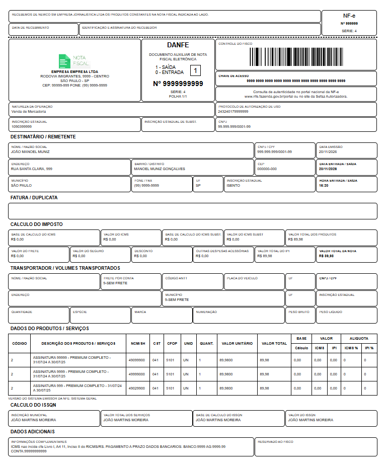

# 📄 DANFE NF-e (Modelo 55) em HTML e CSS

Template em HTML e CSS que replica o layout da DANFE (Documento Auxiliar da Nota Fiscal Eletrônica - modelo 55), pronto para uso em sistemas web e geração de PDF.

Template of Brazilian NF-e DANFE (Model 55) built with HTML and CSS.

---

## 🚀 Preview

---

## 🎯 Objetivo

Este projeto foi criado para ajudar desenvolvedores que precisam:

- Gerar DANFE em sistemas web  
- Converter HTML em PDF (PHP, Node.js, etc.)  
- Simular notas fiscais para testes  
- Estudar o layout da NF-e brasileira  
- Integrar com sistemas ERP  

---

## 🧱 Estrutura do Projeto

/danfe-nfe-html-template
├── index.html
├── style.css
├── /assets
│ └── imagens 
├── /exemplo
│ └── danfe-exemplo.pdf
└── README.md

---

## 🛠️ Tecnologias

- HTML5  
- CSS3  

---

## ⚙️ Como usar

Clone o repositório:

Abra o arquivo `index.html` e substitua os dados pelos valores do seu sistema:

{{emitente}}  
{{cnpj}}  
{{valor_total}}  
{{chave_acesso}}  

---

## 📦 Aplicações

- Geração de PDF (backend)  
- Sistemas ERP  
- Integração com APIs fiscais  
- Projetos em Laravel, Vue.js, Node.js  

---

## ⚠️ Aviso Importante

Este projeto é apenas um modelo visual da DANFE.  
Não possui validade fiscal e não substitui documentos oficiais emitidos pela SEFAZ.

---

## 💡 Roadmap

- [ ] Layout responsivo  
- [ ] Versão Vue.js  
- [ ] Template Laravel (Blade)  
- [ ] Geração automática de PDF  
- [ ] Suporte a dados via JSON  

---

## 🤝 Contribuição

Contribuições são bem-vindas.

---

## 📄 Licença

Este projeto está sob a licença MIT.

---

## ⭐ Apoie

Se esse projeto te ajudou, deixe uma estrela ⭐

---

## 👨‍💻 Autor

Vitor Zanco
